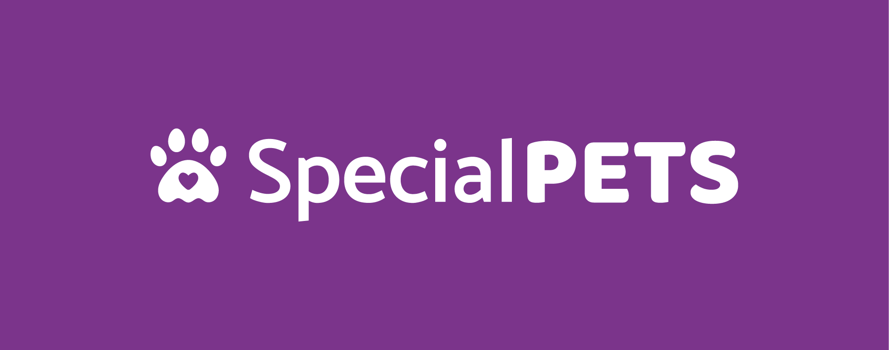

<h1 align="center">
    <br>
    <p align="center"><strong>Special Pets</strong> - Projeto Final {reprograma} | Turma On19<p>
</h1>

<p align="center">

</p>

## 1. Qual o problema? 

<br>
<p align="justify"> Este projeto parte de uma vivência particular de adoção. Adotei duas cachorras fêmeas SRD. A <strong>Babete</strong> - hoje com 10 anos - se mostrava aparentemente muito saudável quando, aos 3 meses, surgiram algumas alterações na pálpebra. Após exame detalhado foi diagnosticada a leishmaniose. Na clínica que a levamos, a primeira recomendação da veterinária era que fosse realizada a eutanásia! Contrariando todos os prognosticos, tendo sido tratada com todos os cuidados necessários e muito amor, ela tem uma condição de vida praticamente normal e segue superando todas as expectativas. 

<p align="justify"> A <strong>Brisa</strong> - hoje com 5 anos - foi deixada em um terreno baldio junto com sua mãe e irmãos. Uma ONG próxima fez o resgate deles e ela, a mais frágil da ninhada, apresentava problemas na pele e em um dos olhos. Por estes motitvos estava difícil encontrar tutores interessados em adotá-la. As meninas responsáveis pela ONG entraram em contato e no momento em que a vimos, já sabíamos que a Babete ganharia uma irmã canina. 

<p align="justify"> Esses animais precisam de um nível maior de atenção e cuidados - além de gastos com suporte, medicamentos, entre outros -, é muito mais difícil que alguém opte por adotar um animalzinho com certa limitação. É necessário que seus tutores tenham consciência da grande responsabilidade e atenção necessárias no dia a dia, garantindo que esses pets tenham uma qualidade de vida tão agradável quanto a de outro animal sem ressalvas.

<br>
<br>

## 2. O que pretende o projeto <strong>specialPets</strong>?     

<p align="justify"> Animais com algum tipo de deficiência e/ou comorbidade ficam aguardando a adoção por muito mais tempo. A <strong>specialPets</strong> busca ser um ambiente de acolhimento e referência para esses bichinhos, conectando-os a tutores responsáveis e dispostos a oferecer condições dignas a eles. 

<p align="justify"> Eles só precisam de uma chance. Quem adota um animalzinho com deficiência e/ou comorbidade quer mais é exibir do que eles são capazes. Afinal, eles são <strong>MEGA</strong>: mega animados, mega determinados, mega amorosos e mega gratos. 

<br>

<p align="center">

</p>
Arte:

- [Melina Moraes](https://www.instagram.com/melinaspm/)

<br>

 ## 3. Como vai funcionar? 

<p align="justify"> <strong>specialPets</strong> é uma API RESTfull desenvolvida com a tecnologia Javascript no Node.js e integrada ao MongoDB Atlas. São cadastrados pets - cachorros e gatos - com qualquer tipo de deficiência e/ou condição que demande maior atenção e cuidado. Será possível realizar o cadastro, atualização, encontrar pets por tipo, por gênero e visualizar todos os pets disponíveis e suas descrições. 

Cadastro, atualização e deleção de informações só podem ser realizadas por usuárias/os já cadastradas/os no sistema.

## 4. Tecnologias utilizadas na construção da API:
| Ferramenta | Descrição |
| --- | --- |
| `javascript` | Linguagem de programação. |
| `nodejs` | Runtime de JavaScript baseado no motor V8 JavaScript do Chrome.|
| `express` | Framework Node.js. |
| `MongoDb` | Banco de dado não relacional orietado a documentos.| 
| `npm` | Gerenciador de pacotes.|
| `nodemon` | Dependência que monitora todas as alterações nos arquivos da aplicação e reinicia automaticamente o servidor sempre que for necessário.| 
| `cors` | Dependência que permite que um site acesse recursos de outro site mesmo estando em domínios diferentes.|     
| `mongoose` | Dependência que interage com o MongoDB para a conexão da database, criação do model e das collections.|
| `jsonwebtoken` | Dependência de autenticação entre duas partes por meio de um token assinado que autentica uma requisição web.|
| `bcrypt` | Biblioteca que adiciona um código aleatório ao hash original.|
| `dotenv` | Dependência para proteger dados sensíveis do projeto.|
| `Postman` | Interface gráfica para realizar testes.|
| `MongoAtlas` | Serviço de DBaaS (Banco de Dados como Serviço) oferecido pela MongoDB.|
| `Render` | O Render é uma plataforma nuvem que faz deploy de várias aplicações back-end seja para hospedagem, testes em produção ou escalar as suas aplicações.|
| `Swagger` | O Swagger é um framework composto por diversas ferramentas que, independente da linguagem, auxilia a descrição, consumo e visualização de serviços de uma API REST.|


<br>
<br>

## 5. 📁 Arquitetura MVC

```
 📁 special-pets-reprograma
   |
   |-  📁 src
   |    |
   |    |- 📁 assets
   |    |    |- 📄 
   |    |    |- 📄 
   |    |    |- 📄 
   |    |    |- 📄 
   |    |    |- 📄 
   |    |    |- 📄 
   |    |  
   |    |- 📁 controllers
   |    |    |- 📄 ownersController.js 
   |    |    |- 📄 petsController.js 
   |    |
   |    |- 📁 database
   |    |    |- 📄 dbConnect.js
   |    |
   |    |- 📁 models
   |    |    |- 📄 ownersModel.js
   |    |    |- 📄 petsModel.js
   |    | 
   |    |- 📁 routes
   |    |    |- 📄 index.js
   |    |    |- 📄 ownersRoute.js
   |    |    |- 📄 petsRoute.js
   |    |- 📄 app.js 
   |    |
        |- 📁 swagger
   |    |    |- 📄 swagger_output.json
   |    |
   |- 📄 .env.example
   |- 📄 .gitignore
   |- 📄 package-lock.json
   |- 📄 package.json
   |- 📄 README.md 
   |- 📄 server.js
   |- 📄 swagger.js
```

<br>
<br>

## 6. Documentação da API

- [Swagger](http://localhost:1313/special-pets-documentation/)

- [Render](https://special-pets-reprograma.onrender.com/special-pets-documentation/)

### 6.1 Rotas de dono(a)s

Endpoint: {{URL}}api/owner 
Rota | Método | O que faz |
| --- | --- | --- |
| `/all` | GET | Retorna todas as donas/os cadastradas/os |
| `/:id` | GET | Retorna donas/os por id |
| `/add` | POST | Adiciona donas/os |
| `/login` | POST | Adiciona login de donas/os |
| `/:id` | PATCH | Atualiza donas/os por id |
| `/:id` | DELETE | Deleta donas/os por id |

### 6.2 Rotas de Pets

Endpoint: {{URL}}api/pets 

Rota | Método | O que faz |
| --- | --- | --- |
| `/add` | POST | Cadastro de pets |
| `/all` | GET | Retorna todos os pets cadastrados |
| `/search/:petbytype` | GET | Retorna os pets por tipo |
| `/search/:petbygender` | GET | Retorna os pets por gênero |
| `/:id` | GET | Retorna os pets por id |
| `/:id` | PATCH | Atualiza dados do pet localizado por id |
| `/:id` | DELETE | Deleta pets cadastrados através do id |

<br>

### 6.3 Schemas

### 6.3.1 Owners Model

 ```jsx
(
    {
        _id: {
            type: mongoose.Schema.Types.ObjectId,
            default: mongoose.Types.ObjectId
        },
        name: {
            type: String,
            required: true,
            unique: true
        },
        birthDate: {
            type: String,
            required: true
        },
        cpf: {
            type: String,
            required: true
        },
        address: {
            type: String,
            required: true
        },
        phone: {
            type: String,
            required: true
        },
        email: {
            type: String,
            required: true
        }
    },

    {
        timeStamp: true
    }
)
```
### 6.3.2 Pets Model

 ```jsx
(
    {
        _id: {
            type: mongoose.Schema.Types.ObjectId,
            default: mongoose.Types.ObjectId
        },
        name: {
            type: String,
            required: true,
            unique: true
        },
        age: {
            type: Number,
            required: true
        },
        gender: {
            type: String,
            required: true
        },
        breed: {
            type: String,
            required: true
        },
        size: {
            type: String,
            required: true
        },
        weight: {
            type: String,
            required: true
        },
        condition: {
            type: String,
            required: true
        },
        adopted: {
            type: Boolean,
            required: true
        },
        type: {
            type: String,
            required: true
        },
        description: String,

        owners: {
            type: mongoose.Schema.Types.ObjectId,
            required: false,
            ref: "owners"
        },
    },

    {
        timeStamp: true
    }
)
```
<br>
<br>

## 7. Regras de negócio 

#### Rota de registro:

- [x]  Cadastro só pode ser feito se todos os campos obrigatórios forem preenchidos;
- [x]  Cadastro só pode contemplar cachorros e gatos com deficiência;
- [x]  Cadastro dos pets pode ser feito por qualquer pessoa, a ideia é facilitar a disponibilidade do animal no sistema.

<br>

## 8. Implementações Futuras 

*  Desenvolvimento de uma interface gráfica;
*  Criação de um user responsável por cadastrar pets e padrinhos;
*  Criação de cadastro para padrinhos;
*  Contemplar outros animais.

<br>

## 9. Caso queira contribuir

1. Faça o clone deste repositório;
2. Abra seu Terminal/Prompt e navegue até o diretório special-pets-reprograma;
3. Rode: **$ npm install**;
4. Para subir o servidor basta rodar **$ npm run start**.

<br>

## 10. Autora 👩‍🚀

## Pâmela Santos
- [Linkedin](https://www.linkedin.com/in/pamelasantoss/)
- [Github](https://github.com/tipopamela)
- [Instagram](https://www.instagram.com/tipopamela)

Desenvolvido com muito 💙

## Agradecimento

<p align="justify"> Agradeço a <strong>{reprograma}</strong> por proporcionar um ambiente seguro de aprendizagem e acolhimento, a cada professora e monitora que esteve conosco, compartilhando seus conhecimentos e vivências. Agradeço a Jani, Mayhhara, Ju e Liana por seu apoio. E um muito obrigada a <strong>turma On19</strong> - esse grupo de mulheres incríveis, que irão trilhar caminhos lindos por onde passarem. Foi inspirador conhecê-las e compartilhar essas 18 semanas com vocês! 💜 

Meu agradecimento especial para a **Mari**, minha namorada, amiga, parceira, meu apoio em todos os momentos. 🖤💙